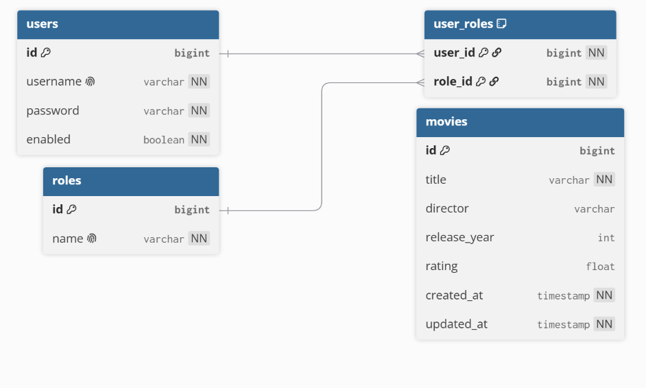

# Secure Movie Library - Technical Overview

## 1. Overview

The lazily named "Movie Library" is a Spring Boot
REST API for managing a catalog of movies, with two
features layered on top of plain CRUD: JWT-based 
authentication/authorization, and background acquisition
of each movie's rating from OMDb.

Structurally the project is split into `controller`
(HTTP layer), `service` (business logic, interface +
implementation), `repository` (persistence, interface +
implementation), and `model` (JPA entities), with a
separate `dto` package for what actually
crosses the API boundary. On top of that there's
`security` (JWT + Spring Security wiring), `exception`
(custom exceptions + global handler), `external`
(OMDb client), and `config` (bean/infra
configuration).

Here's what the flow looks like functionally:

1. A client logs in via `POST /api/auth/login` with a 
username/password and receives a signed JWT 
(`AuthController`, `JwtService`).

2. Every subsequent request carries that JWT in the 
`Authorization: Bearer <token>` header. 
`JwtAuthenticationFilter` validates it on the way in 
and attaches the resolved user and roles to the 
request's security context.

3. From there, `ADMIN` and `USER` are the two roles in 
the system. `USER` can only read movies, while `ADMIN` 
can also create/update/delete movies and manage users 
(`SecurityConfig`).

4. Creating a movie (`POST /api/movies`) persists it 
immediately and returns a response right away. The 
lookup of its rating from OMDb happens afterwards, on 
a background thread, and updates the record once it 
completes (`MovieServiceImpl`,`RatingEnrichmentServiceImpl`).

5. Errors (validation failures, missing resources, bad 
credentials, unauthorized access) all come back as 
the same consistent JSON error shape 
(`GlobalExceptionHandler`, `ErrorResponse`).

Stack: Java, Spring Boot (Web, Security, Validation, 
Data JPA's `EntityManager`, Async), MariaDB for 
persistence with Flyway-managed migrations, JJWT for 
token signing/parsing, and springdoc-openapi for 
Swagger documentation and functionally a frontend for manual
API testing.

## 2. Database
Before proceeding with any explanations, I must state the following. Considering 
that using a Docker Container is out of scope and I have no `docker-compose` File,
in order to have a Database at all one needs to run
`CREATE DATABASE movie_library;` manually in the MariaDB terminal.
The Flyway connection reads and executes 
`V1__create_schema.sql` towards an existing Database - 
it cannot create that database itself, because the 
JDBC URL (`jdbc:mariadb://host:port/movie_library`) 
already names the target database as part of the 
connection handshake. The database has to exist 
beforehand. That is why we have to do it manually,
but I think that is a sacrifice we will learn to live with, dear Reader!

Now for the meat of the explanation. The database 
runs on MariaDB, and the schema itself lives entirely 
in the Flyway migration files under 
`src/main/resources/db/migration`.
`spring.jpa.hibernate.ddl-auto` is set to 
`validate`, which means Hibernate is not allowed to 
create or change any tables on its own - all it does 
is double-check that the entity classes (`Movie`, 
`Role`, `User`) actually match whatever tables Flyway 
already built. That way there is exactly one place 
that decides what the schema looks like: the 
migration scripts. Nothing gets silently created or 
changed behind the scenes just because Hibernate 
guessed something from an annotation.

`V1__create_schema.sql` defines four tables:

Deleting a `User` or a `Role` also needs to clean up 
their matching rows in `user_roles`, the join table 
for the many-to-many relationship. This project 
doesn't rely on Hibernate to do that cleanup. The 
`@ManyToMany` mapping on `User` has no `cascade` 
attribute, so Hibernate won't automatically delete 
related `user_roles` rows when a `User` or `Role` is 
removed. Instead, the cleanup is handled directly by 
the database: `user_roles` has `ON DELETE CASCADE` on 
both of its foreign keys (see `V1__create_schema.sql`), 
so MariaDB removes the orphaned rows itself as soon as 
the referenced `user` or `role` row is deleted via 
`EntityManager.remove()`.

## 3. External Rating API

The application gets movie ratings from IMDb using 
OMDb to fetch said ratings (`https://www.omdbapi.com`), 
configured via `omdb.base-url` and `omdb.api-key` in 
`application.yml`.

OMDb was chosen over alternatives like TMDB because 
IMDb is pretty much the standard for movie ratings, 
the API key is very simple to acquire, and the REST 
endpoint accepts a plain movie title 
(`?t={title}&apikey={key}`) and returns a flat JSON 
payload including an `imdbRating` field. In a nutshell 
it was chosen for simplicity.

`OmdbClient` makes the actual HTTP call through a 
`RestTemplate` (see `RestTemplateConfig`), and reads 
the response into a small internal helper class 
(`OmdbSearchResponse`) that only cares about two 
fields: `Response` and `imdbRating`. Everything else 
OMDb sends back gets ignored, thanks to 
`@JsonIgnoreProperties(ignoreUnknown = true)`, because 
I do not need anything else.

There are four different ways this lookup can come 
back empty:

1. The response body itself was null.
2. The movie was not found (`Response` is not `"True"`).
3. It was found but simply has no rating (`imdbRating` 
is `"N/A"`).
4. Something went wrong with the call itself - either 
the HTTP request failed (`RestClientException`) or the 
rating text could not be parsed as a number
(`NumberFormatException`).

In every one of these cases, `fetchRating` just returns 
`Optional.empty()` instead of throwing an exception. A missing 
rating is treated as a normal, expected outcome here - 
not as a failure of whatever request triggered the 
lookup.

## 4. Security / Authorization

Authentication is stateless and JWT-based, configured 
across `SecurityConfig`, `JwtService`, and 
`JwtAuthenticationFilter`:

`POST /api/auth/login` (`AuthController`) 
authenticates against Spring Security's 
`AuthenticationManager`, backed by 
`CustomUserDetailsService` (loads a `User` entity and 
its `Role`s) and a `BCryptPasswordEncoder`. On success 
it returns a signed JWT (`JwtService.generateToken`), 
containing the username as subject and the user's 
granted authorities as a claim.

`JwtAuthenticationFilter` runs once per request, 
reads the `Authorization: Bearer <token>` header, and 
validates the token's signature/expiry 
(`JwtService.isTokenValid`). If it's valid, it 
populates the `SecurityContextHolder` so the rest of 
the request is treated as authenticated.

Sessions are disabled 
(`SessionCreationPolicy.STATELESS`) and CSRF is 
disabled, since there's no browser session/cookie to 
protect. Every request re-authenticates via its own 
bearer token.

There are two roles, `ADMIN` and `USER`, along with 
the default `admin`/`user`/`gergincho`/`parashkevica` 
accounts, all 
seeded by the Flyway migration 
`V2__seed_data.sql` rather than created in code at 
startup - the passwords in that script are already 
BCrypt hashes, never plaintext. Each `Role.name` (e.g. 
`"ADMIN"`) gets mapped to a Spring Security authority 
prefixed with `ROLE_` in `CustomUserDetailsService`, 
since `hasRole(...)` 
checks for that prefix internally.

The authorization rules themselves are defined in 
`SecurityConfig#securityFilterChain`:

`/api/auth/**` and the Swagger UI/API docs are public.

`GET /api/movies/**` requires either `ADMIN` or `USER`.

The remaining `/api/movies/**` methods (POST/PUT/DELETE) 
are restricted to `ADMIN`.

`/api/users/**` is `ADMIN`-only across all methods.

Everything else simply requires authentication.

Unauthenticated or unauthorized requests are handled 
by `JwtAuthenticationEntryPoint` (401) and 
`JwtAccessDeniedHandler` (403) respectively. Both 
return the same `ErrorResponse` JSON shape used by 
`GlobalExceptionHandler` for other errors, so every 
error response from the API looks the same no matter 
where it came from.

## 5. Asynchronous Enrichment

Rating enrichment can't be allowed to slow down movie 
creation, so it runs separately from the normal 
request, using Spring's async support. `@EnableAsync` 
on `MovieLibraryApplication` turns this on for the 
whole app.

When a movie gets created, `MovieServiceImpl.createMovie` 
saves it to the db right away, so the client immediately gets 
back a movie with a real id. Only after that does it 
call `RatingEnrichmentService.enrichRatingAsync(id, 
title)` - and it does not wait around for that call 
to finish before returning.

The method `RatingEnrichmentServiceImpl.enrichRatingAsync`
is marked `@Async`, which makes Spring run it on a 
separate thread instead of the current one (using the 
default `SimpleAsyncTaskExecutor`, since setting up a 
custom thread pool is out of scope. Inside it asks 
`OmdbClient` for a rating and only touches the database if the movie is still 
there and a rating actually came back. If anything 
goes wrong along the way i.e. a network error, a bad 
number it quietly comes back as nothing found.
Nothing gets retried or logged, and whoever 
made the original POST request never even finds out.

Because of that, there is also a separate, 
synchronous endpoint: `POST 
/api/movies/{id}/refresh-rating`. It lets a client 
ask for the rating to be looked up again and actually 
wait for the result, since the automatic lookup on 
creation is deliberately fire-and-forget. Like every 
other write operation on movies, it is restricted to 
`ADMIN` - a `USER` gets a 403 if they try it. 
In a moment of honesty I want to state that this endpoint was
mostly setup as a testing ground for the OMDb API to test if movies that have 
already been added in the database through the `V2__seed_data.sql` get updated. 

## 6. Architectural Decisions & Trade-offs

The project follows a fairly standard layered 
architecture: `controller` → `service` (interface + 
impl) → `repository` (interface + impl) → `model`, 
with `dto` covering request/response shapes. 
Controllers and services depend on interfaces, not 
implementations, so the persistence and business 
logic stay swappable and easy to test in isolation.

The API never sends or receives entity classes 
directly. Request DTOs (`MovieRequestDTO`, 
`UserRequestDTO`) only hold the fields a client is 
actually allowed to set - so no `id`, and no `rating` 
either, since that gets filled in later. They also 
have their own validation rules, kept separate from 
whatever the entity/database enforces.

Response DTOs 
(`MovieResponseDTO`, `UserResponseDTO`) simplify 
things on the way out too. For example a user's 
roles go from a `Set<Role>` down to 
`Set<String>` of role names, and the password hash 
never gets included at all.

Repositories are implemented manually against 
`EntityManager` (`MovieRepositoryImpl`, etc.) rather 
than through Spring Data's auto-generated repositories. 
It means writing more boilerplate for basic CRUD, but 
every query and transaction boundary is explicit in 
the code instead of being generated behind the scenes.

Enrichment failures are swallowed instead of 
retried. That's simple and satisfies the requirement 
that the initial POST can't be delayed by the 
external call, but it also means a transient OMDb 
outage silently leaves a movie's rating unset until 
someone calls `refresh-rating` manually. A production 
version would probably add retry with backoff and/or 
some kind of log trail for failed enrichments, but as
things stand right now this is out of scope.

There's also no custom `ThreadPoolTaskExecutor` 
configured. `@Async` methods run on Spring's 
default `SimpleAsyncTaskExecutor`, which spawns a new 
thread per task rather than pooling them. Fine as of
right now, but it wouldn't bound concurrency under 
heavier load, and to be honest I had to fight the urge
to make a `ThreadPoolTaskExecutor`. Sadly I only had a 
week for this project and that, I decided, was a headache
for another day.

There's no public self-registration endpoint. It was 
technically out of scope. I decided not to do it because
the project was focused on the movie management, and not the
user management anyways. It specifically only asks for a login mechanism
and at least two roles with proper authorization rules, not a way for 
anyone to sign themselves up, so accounts are seeded 
via `V2__seed_data.sql` and otherwise managed by an 
`ADMIN` through `UserController`. One would guess that
I would make one out of habit...but I didn't.

Finally, `GlobalExceptionHandler` centralizes 
translation of the exceptions 
(`MovieNotFoundException`, `UserNotFoundException`, 
`RoleNotFoundException`, `InvalidCredentialsException`), 
bean-validation failures, and a generic fallback, all 
into the same `ErrorResponse` shape (timestamp, 
status, error, message, path) so that the API consumers get 
one consistent error format no matter what went 
wrong.
